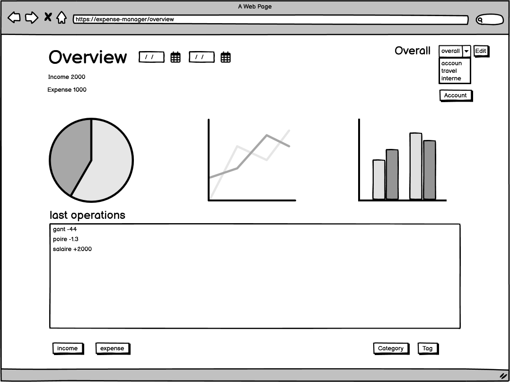
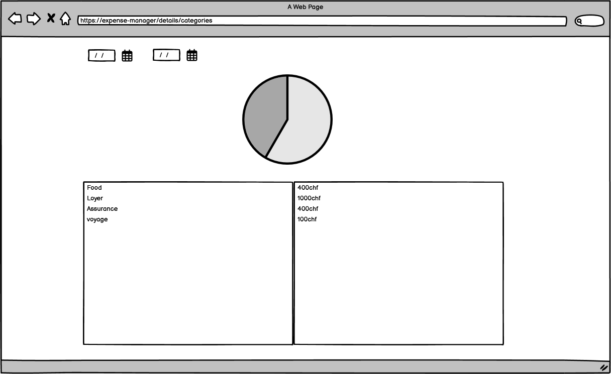
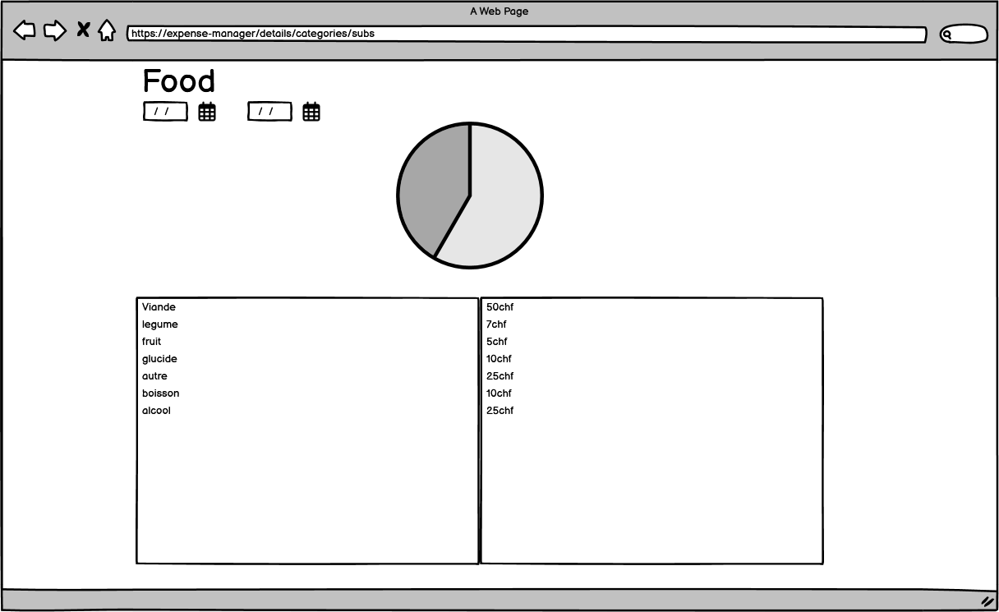
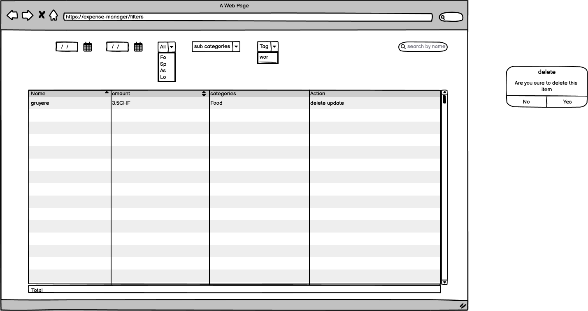
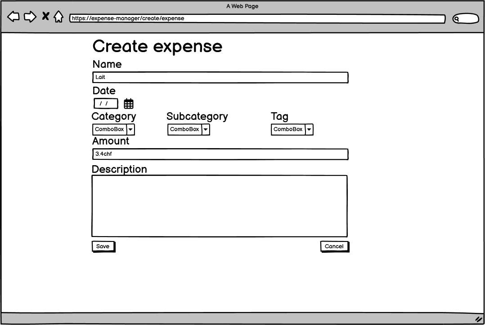
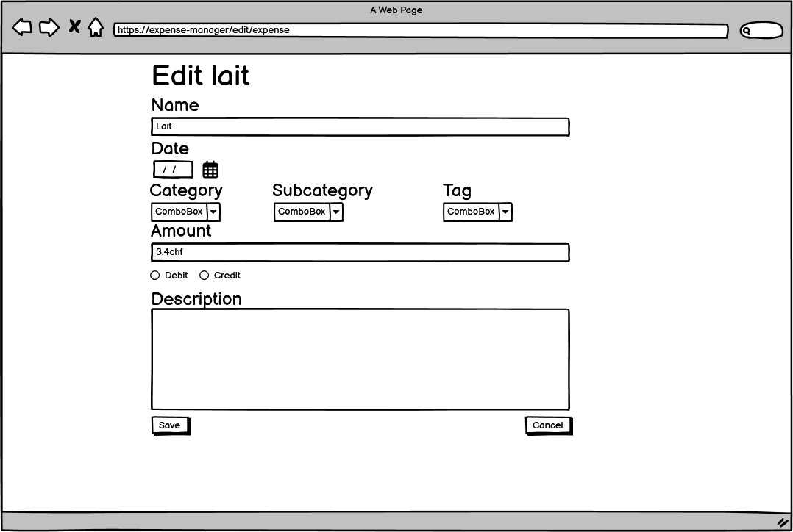
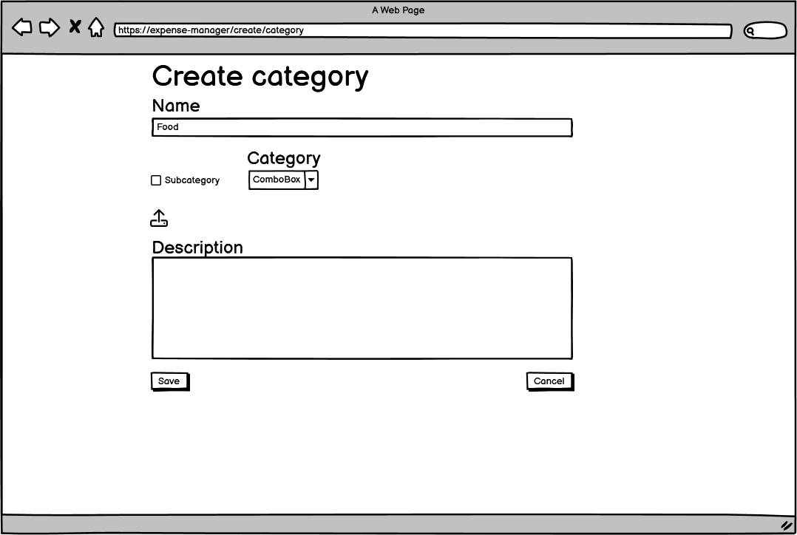
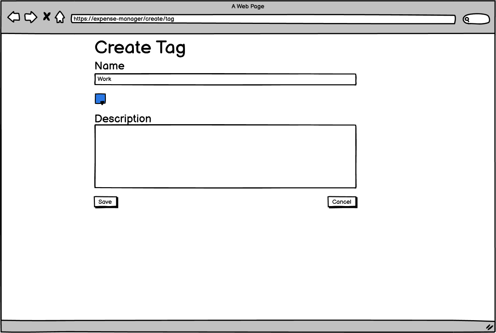

# Cahier des charges
This app needs to track expense of an user day by day. The user needs to enter his expense, select its category and save it. He can filter his criteria time/category to have an overview of his expense. He has access to statistics to know his performance. 

## limitation
for now I will only do it for local user

## Tasks explained:
### expense day by day:
user is presented a form where he enter:
-  date;optional hour
-  the category;subcategory
-  tag
-  comment/description
-  title
-  price 
- select the source account debited

save it,  delete it, update it

### income
similar to expense he can also enter its income

### accounts
he can create accounts from where the money is debited/credited, define it balance.

### categories
user have access to a panel to create a categories. He will enter the name of the category and can select an image to defined it. he has an option to select if it a categorie he will then have to scroll and select the category associated

### tags
tag is used to defined something if it important for work of thing like that. user can create those:
- name
- color
- description

### filters
user can filter 
- expense / income
- date range
- categories
- tag
- price value ?
- name

### overview
the user will have basic information of his situation like expense vs income. graph/stats displaying where (categories) the expenses goes

## need to do
- expense
- time tracking
- filters
- accessible 
- authentication ?
- upload image ?
- graph
- categories/subcategories
- tags

## app look
### overview

### filters

### expense

### category creation

### tag creation

### accounts
### login

## DB schema
### categories
### expense
### tag
### accounts
### user
### connect
### currency

## program architecture

